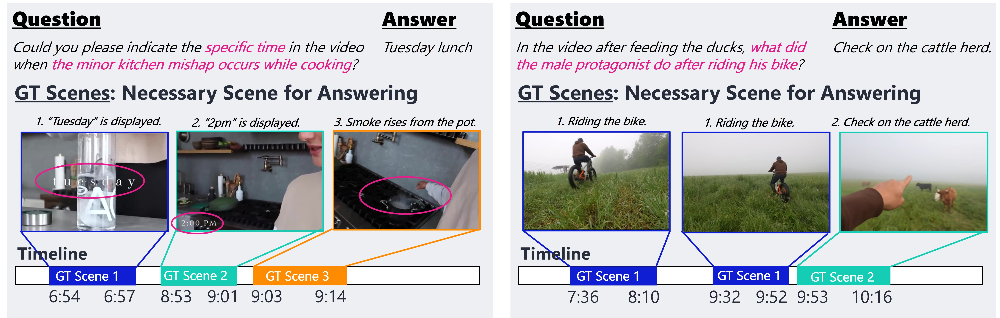

# KFS-Bench

This repository provides KFS-Bench dataset and evaluation code introduced in the paper '[***KFS-Bench: Comprehensive Evaluation of Key Frame Sampling in Long Video Understanding***](https://arxiv.org/abs/2512.14017)', which is accepted at ***WACV 2026***.

KFS-Bench is the first benchmark for long video QA with multi-scene annotations, enabling direct evaluation of key frame sampling.

<p align="center">
    </a> <br>
</p>

## Ground Truth Data Format

The CSV files contain the following columns:
- `id`: Video identifier
- `segment_id`: Segment identifier
- `scene_id`: Scene identifier (for grouping related segments)
- `start`: Start timestamp
- `end`: End timestamp

## Evaluation

```bash
python eval.py --anno_file lvb_anno.csv --result_file your_results.json 
```

You can perform the same evaluations as those conducted in the experiments described in the paper.
```bash
python eval.py --anno_file lvb_anno.csv --result_file qwen_7b_64_lvb_results.json
python eval.py --anno_file vidmme_anno.csv --result_file qwen_7b_64_vidmme_results.json 
```

To evaluate your result, the model result JSON file must have the following structure:
```json
[
  {
    "id": "video_identifier",
    "frame_timestamps": [1.5, 3.2, 5.8, ]
  },
]
```

## Citation
If you find our work helpful for your research, please consider citing our work.  
```bibtex
@inproceedings{li2026kfs,
  title={KFS-Bench: Comprehensive Evaluation of Key Frame Sampling in Long Video Understanding},
  author={Li, Zongyao and Ishida, Kengo and Yamazaki, Satoshi and Ji, Xiaotong and Liu, Jianquan},
  booktitle={Proceedings of the IEEE/CVF Winter Conference on Applications of Computer Vision},
  pages={5643--5652},
  year={2026}
}
```

